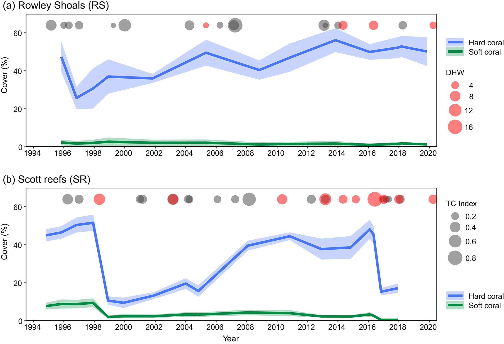

```{r packages, echo=FALSE, message=FALSE, warning=FALSE}
library(tidyverse)
library(janitor)
```


```{r echo=FALSE, message=FALSE, warning=FALSE}
theme_set(theme_light()+
  theme(text = element_text(size = 18))) 
```

# What's in a data analysis?

## Five core activities of data analysis

1. Stating and refining the question
1. Exploring the data (exploratory data analysis)
1. Building formal statistical models
1. Interpreting the results
1. Communicating the results

*Roger D. Peng and Elizabeth Matsui. "The Art of Data Science." A Guide for Anyone Who Works with Data. Skybrude Consulting, LLC (2015).*

# Stating and refining the question

## Six types of questions

1. **Descriptive:** summarize a characteristic of a set of data
1. **Exploratory:** analyze to see if there are patterns, trends, or relationships between variables (hypothesis generating)
1. **Inferential:** analyze patterns, trends, or relationships in representative data from a population
1. **Predictive:** make predictions for individuals or groups of individuals
1. **Causal:** whether changing one factor will change another factor, on average, in a population
1. **Mechanistic:** explore "how" as opposed to whether

*Jeffery T. Leek and Roger D. Peng. "What is the question?." Science 347.6228 (2015): 1314-1315.*


## Examples of research questions: Does Vitamin D prevent COVID-19 infection?

::: {.incremental}

1. **Descriptive:** frequency of hospitalizations due to COVID-19 in a data set collected from a group of individuals
1. **Exploratory:** examine relationships between a range of dietary factors and COVID-19 hospitalizations
1. **Inferential:** conduct statistical test to test whether relationships between taking Vitamin D supplements and COVID-19 hospitalizations found in the sample hold for the population at large
1. **Predictive:** predict what types of people will take Vitamin D supplements during the next year using statistical testing
1. **Causal:** conduct an experiment to test whether the hospitalization rate differs for people with COVID-19 who were randomly assigned to take Vitamin D supplements vs. those who were not assigned to take Vitamin D 
1. **Mechanistic:** investigate the physiological mechanism by which increased vitamin D intake leads to a reduction in the number of viral illnesses
:::


# Exploratory data analysis


## Questions to ask when beginning an analysis

- Do you have right data to answer your question?

- Do you have information on confounding variables (other variables that can affect the variable(s) of interest)?

- Was the data you're working with collected in a way that introduces bias?


## Beware of confounding variables

Suppose I collect data on sunburns and ice cream consumption and find that higher ice cream consumption is associated with a higher probability of sunburn. 

::: {.incremental}
- Does that mean that ice cream consumption causes sunburn? 
- What might be a *confounding variable*? 
- Can you think of an example from ecology/the environment? 
- How can we control for confounding variables in our analyses? 
:::

## Beware of biased data

Suppose I want to estimate the average number of children in households in St. Mary's County. I conduct a survey at an elementary school in the county and ask students at this elementary school how many children, including themselves, live in their house. Then, I take the average of the responses. 

::: {.incremental}
- Is this a biased or an unbiased estimate of the number of children in households in the county? 
- If biased, will the value be an overestimate or underestimate? 
- How can we minimze bias in our analyses?
:::


## Exploratory data analysis checklist

- Formulate your question
- Read in your data
- Get to know your data
  - Check the dimensions
  - Look at the top and the bottom of your data
  - Understand sampling unit scales, units of measure, etc.
- Wrangle
- Plot


## Australian coral cover dataset

Read in the data: 
```{r}
url1  <- "https://pasta.lternet.edu/package/data/eml/edi/952/1/f6212784c45d0a077f2c863868d22c4b" 
cover <-read_csv(url1)

cover
```


## Formulate your question

- Which species are dominant at each system and location?
- Are there differences in coral cover over time in Rowley Shoals vs. Scott reefs?
- Are there differences in coral cover over time depending on species?
- Most importantly: Do I have the right data to answer these questions?


## Get to know your data: look at the dimensions and variables

```{r}
glimpse(cover)
```


## Understand sampling unit scales, units of measure, etc.

Go to the metadata and read! Make sure you fully understand it.

[Data overview](https://portal.edirepository.org/nis/metadataviewer?packageid=edi.952.1)

*We illustrate how coral bleaching is altering reefs by contrasting the dynamics of adjacent reef systems over more than two decades. Both reef systems sit near the edge of the northwest Australia’s continental shelf, have escaped chronic local pressures and are regularly affected by tropical storms and cyclones. The Scott reef system has experienced multiple bleaching events, including mass bleaching in 1998 and 2016, from which it is unlikely to fully recover. The Rowley Shoals has maintained a high cover and diversity of corals and has not yet been impacted by mass bleaching.*

## Understand sampling unit scales, units of measure, etc.

Based on the data overview, questions might revolve around assessing differences in coral cover across systems. `System` is one sample id variable:

```{r}
cover |>
  distinct(System)
```

## Understand sampling unit scales, units of measure, etc.

`Reef` is a sample id variable:

```{r}
cover |>
  distinct(Reef)
```

## Understand sampling unit scales, units of measure, etc.

`Location` is a sample id variable:

```{r}
cover |>
  distinct(Location)
```


## Understand sampling unit scales, units of measure, etc.

`Year` is a sample id variable:

```{r}
head(cover$`Year (decimal)`)
```


## Understand sampling unit scales, units of measure, etc.

The remaining variable names are coral species groups and values are % cover (units are % bottom cover)

```{r}
names(cover[,5:18])
```


## Wrangle the obvious

Some wrangling needs may be obvious, but other wrangling pipelines may depend on the question.

- We definitely need to pivot longer to convert to tidy format (every row is an observation, every column is a variable), and clean the variable names:
```{r}
cover_tidy <- cover |>
  pivot_longer(cols = 5:18, names_to = "species", values_to = "cover") |>
  clean_names()

cover_tidy
```


## Wrangle to answer a specific question

If we want to ask if there are differences in coral cover over time at Rowley Shoals vs. Scott reefs, grouping by hard and soft coral cover to simplify things. We want to make a plot like this (minus the DHW and TC index data):



## We need to be sure we are summarizing our data at the appropriate sampling unit

Sometimes, there is more than one observation per year: 
```{r}
cover_tidy |>
  distinct(year_decimal) |>
  arrange(year_decimal) |>
  print(n = 26)
```


## Plot to further explore sampling units

Plot to quickly look at cover observations across spatial groupings. There is only location per reef at Rowley Shoals:

::: {.columns}
::: {.column width="40%"}
```{r eval=FALSE}
cover_tidy |>
  filter(system == "Rowley Shoals") |>
ggplot(aes(x = year_decimal, y = cover, fill = species)) +
  geom_bar(stat = "identity") +
  facet_wrap(location~reef)
```
:::
::: {.column width="60%"}
```{r echo=FALSE}
cover_tidy |>
  filter(system == "Rowley Shoals") |>
ggplot(aes(y = location, fill = species)) +
  geom_bar() +
  facet_wrap(~reef)
```
::: 
:::


## Plot to further explore sampling units

There are multiple locations for some reefs at Scott reefs. Also there are overall more sampling locations at Scott reefs compared to Rowley Shoals:

::: {.columns}
::: {.column width="40%"}
```{r eval=FALSE}
cover_tidy |>
  filter(system == "Scott reefs") |>
ggplot(aes(y = location, fill = species)) +
  geom_bar() +
  facet_wrap(~reef)
```
:::
::: {.column width="60%"}
```{r echo=FALSE}
cover_tidy |>
  filter(system == "Scott reefs") |>
ggplot(aes(y = location, fill = species)) +
  geom_bar() +
  facet_wrap(~reef)
```
::: 
:::


## Understanding the data structure is crucial

Get a handle on the observational scales. For field data like this, think about what the researchers measured during each sampling trip and how we identify each sampling trip:

- There are multiple `reefs` per `system` and multiple `locations` per `reef`. Therefore `location` is our smallest spatial sampling unit - the researchers repeated the same set of measurements at each location.
- `reef` indicates larger spatial groupings of `location`
- `system` indicates even larger spatial groupings of `reef`
- The researchers also repeated these measurements each decimal year. `year_decimal` is our smallest temporal sampling unit.


## Wrangle to answer a specific question

If we want to know the mean and standard error (SE) coral cover for hard and soft corals for each *year* and *system*, we first need to calculate how much *total* hard and soft coral there was (since percent cover was measured for more than one hard coral species) for the *smallest spatial and temporal sampling units*. Then calculate the mean and SE for each species, decimal year, and system:

1. Recode species so that species is either hard coral or soft coral.
2. Calculate total cover for each recoded species group (hard_coral and soft_coral), `year_decimal` and `location`. Keep `system` as a grouping variable so it is preserved in the output for the next step.
3. Calculate mean and SE coral cover for hard and soft corals for each year and system.


## Plot to answer a specific question

Do hard and soft coral cover trends differ at Rowley Shoals vs. Scott reefs?

```{r echo=FALSE}
se <- function(x) sd(x, na.rm = TRUE) / sqrt(length(x))

cover_tidy |>
  mutate(species = if_else(species == "Soft Coral", "Soft coral", "Hard coral")) |>
  group_by(system, location, year_decimal, species) |>
  summarize(cover = sum(cover)) |>
  group_by(system, species, year_decimal) |>
  summarize(mean_cover = mean(cover),
            se_cover = se(cover)) |>
  ungroup() |>
  ggplot(aes(x = year_decimal, y = mean_cover, fill = species)) +
  geom_ribbon(aes(ymin = mean_cover - se_cover, ymax = mean_cover + se_cover), alpha = 0.3) +
  geom_line(aes(color = species)) +
  facet_wrap(~system) +
  labs(x = "", y = "Mean coral cover", title = "Coral cover trends across systems", fill = "", color = "") +
  scale_color_manual(values = c("blue", "darkgreen")) +
  scale_fill_manual(values = c("blue", "darkgreen")) +
  theme(legend.position = "bottom",
        axis.title.x = element_blank())
```

