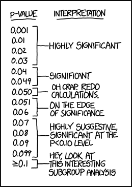
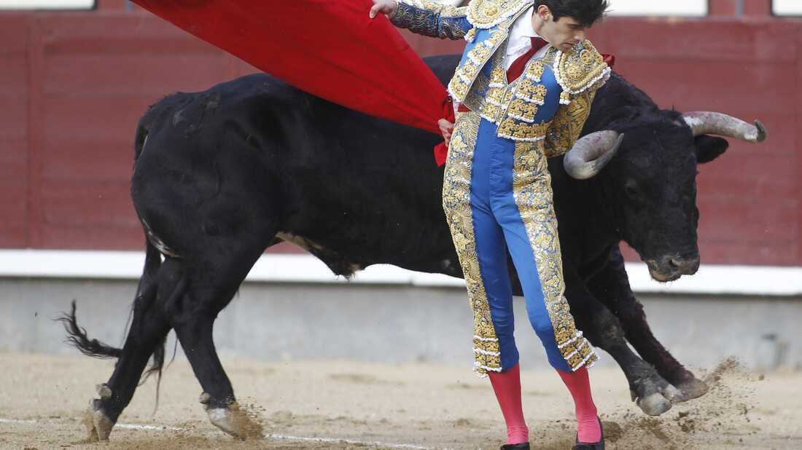
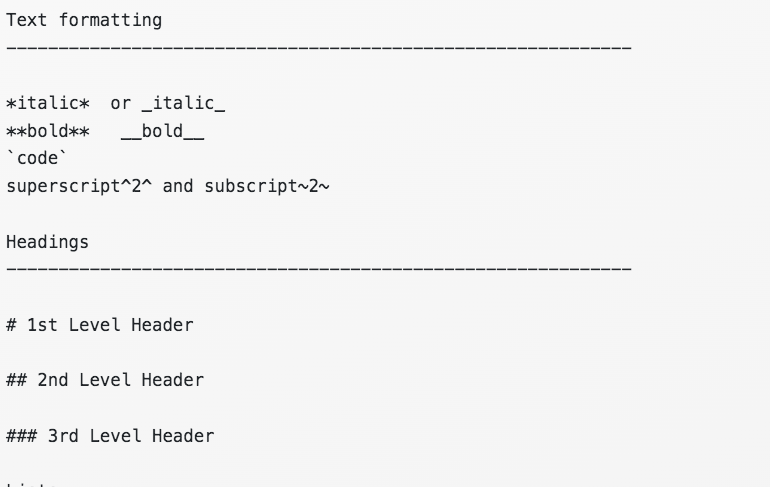
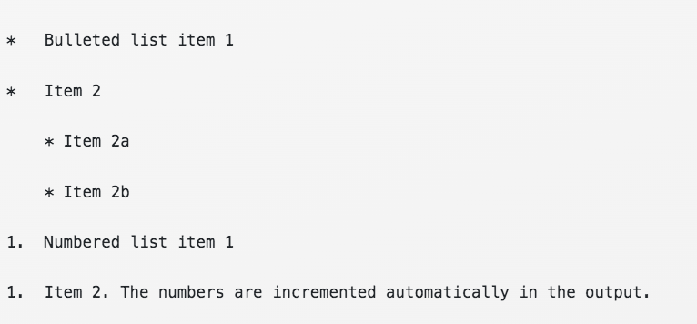
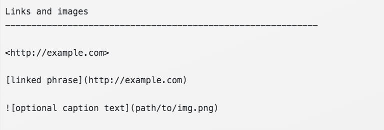
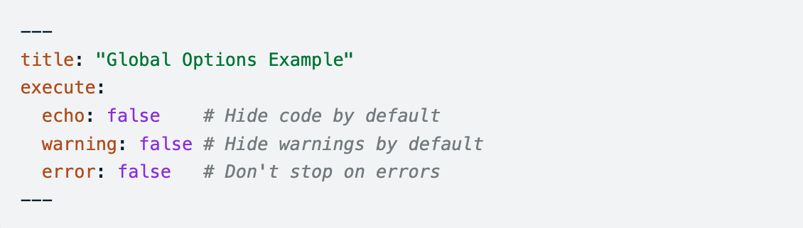
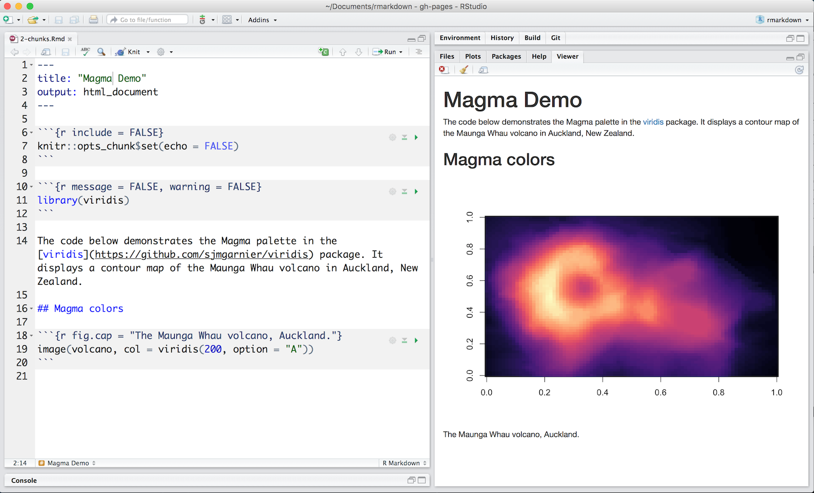

```{r packages, echo = FALSE, message=FALSE, warning=FALSE}
library(tidyverse)
library(patchwork)
library(palmerpenguins)
library(gt)
library(kableExtra)
theme_set(theme_light(base_size = 18))
```


# 1. What is *p*-hacking and why should you avoid it?

# 2. Random tips and tricks


## Use statistics responsibly


# ***p* value:** The probability of obtaining test results at least as extreme as the observed result due to random chance 


## We often use *p* < 0.05 as the cutoff for an acceptable *p*-value, but this is somewhat arbitrary


{fig-alt="xkd cartoon"}


## Over-reliance on *p*-values can lead to questionable choices 

**Why might each of these be problematic?**

- Stop collecting data once *p* < 0.05

- Analyze many measures and/or conditions, but only report those with *p* < 0.05

- Exclude observations to get *p* < 0.05

- Transform the data to get *p* < 0.05


# ***p*-hacking:** A misuse of data analysis to find patterns in data that can be presented as "statistically significant" when in fact there is no underlying effect.


## How to not *p*-hack: Instead of reporting only the good stuff, just report all the stuff

- Report your sample size

- List all variables and levels of categorical variables

- If excluding outliers, report results with outliers included as well

- Report results for all variables tested

## Death of "statistical significance"

*An apt metaphor for the phrase “statistically significant” and its relatives is that of a toro bravo, a champion bull raised for bullfighting who is now on his last legs and awaiting only the coup de grâce.*  

-[Hurlbert et al. 2019](https://www.tandfonline.com/doi/full/10.1080/00031305.2018.1543616)





## Death of "statistical significance"

There is now wide agreement among many statisticians who have studied the issue that for reporting of statistical tests yielding p-values it is illogical and inappropriate to dichotomize the p-scale and describe results as “significant” and “nonsignificant.” Authors are strongly discouraged from continuing this never justified practice that originated from confusions in the early history of modern statistics.

-[Hurlbert et al. 2019](https://www.tandfonline.com/doi/full/10.1080/00031305.2018.1543616)


## How to not *p*-hack: Emphasize what your model results actually *mean* instead of *p-*values
<br>
- Report *p*-values but don't use the term, "statistically significant"

- Discuss apparent relationships or patterns

- **Interpret your results**, and explain their meaning in the context of your study system


## How to not *p*-hack: Emphasize what your model results actually *mean* instead of *p-*values
<br>
**Assume both of these scenarios has *p* < 0.05. Which is more *ecologically* significant?**

"Growth rates were, on average, 5 times greater in the nutrient-treatment plots."

"Growth rates were, on average, 0.01 times greater in the  nutrient-treatment plots."


# More R tips


# Make sure you are comparing apples to apples! Normalize your data when appropriate.


## Where do the most motor vehicle deaths occur?

```{r, echo = FALSE, fig.height = 8}
mvd <- read_csv("23-tying-up-loose-ends/data/motor-vehicle-deaths.csv")

ggplot(mvd, aes(x = Deaths, y = reorder(State, Deaths))) +
  geom_bar(stat = "identity") +
  labs(y = "", title = "Motor vehicle deaths") +
  theme_minimal()
```


## Where do the most motor vehicle deaths occur?
::: {.columns}
::: {.column width="60%"}
```{r, echo = FALSE, fig.height = 8}

p1 <- ggplot(mvd, aes(x = Deaths, y = reorder(State, Deaths))) +
  geom_bar(stat = "identity") +
  labs(y = "", title = "Motor vehicle deaths")

p2 <- ggplot(mvd, aes(x = Population, y = reorder(State, Population))) +
  geom_bar(stat = "identity") +
  labs(y = "", title = "Population")

p1 + p2
```
:::
::: {.column width="40%"}
More people = more motor vehicle deaths. It's hard to tell whether it's because there are just more people on the road, or because driving is more dangerous in some states.
::: 
:::


## Normalize your data if needed for your question

::: {.columns}
::: {.column width="70%"}
```{r, echo = FALSE}
ggplot(mvd, aes(x = `Deaths per 100,000 population`, y = reorder(State, `Deaths per 100,000 population`))) +
  geom_bar(stat = "identity") +
  labs(y = "", x = "Deaths per 100,000 population", 
       title = "Deaths per 100,000 population") +
  theme(text = element_text(size = 14))
```
:::
::: {.column width="30%"}
Normalized to population, Mississippi has the most motor vehicle deaths.

::: 
:::


## Normalize your data if needed for your question

::: {.columns}
::: {.column width="70%"}
```{r, echo = FALSE}
ggplot(mvd, aes(x = `Deaths per 100 million vehicle miles traveled`, y = reorder(State, `Deaths per 100 million vehicle miles traveled`))) +
  geom_bar(stat = "identity") +
  labs(y = "", x = "Deaths per 100 million vehicle miles traveled", 
       title = "Deaths per 100 million vehicle miles traveled") +
  theme(text = element_text(size = 14))
```
:::
::: {.column width="30%"}
Normalized to vehicle miles traveled, South Carolina has the most motor vehicle deaths, with Mississippi a close 2nd.
::: 
:::


# Use markdown formatting in your quarto documents! 


## Use markdown syntax

```{r, echo = FALSE}

```


## Use markdown syntax

```{r, echo = FALSE}

```


## Use markdown syntax

```{r, echo = FALSE}

```


# Use `gt()` to print nicely-formatted data tables

## Don't show raw data table output

Printing a raw, unformatted data table is helpful to you as the data analyst, but not the reader. Remove this from your code before finalizing your report. E.g.:
```{r}
penguins %>%
  filter(species == "Adelie")
```


## Use `gt()` to print nicely-formatted data tables when appropriate

Printing a nice summary table can be useful.  

```{r}
penguins |>
  group_by(species, sex) |>
  summarize(body_mass_g = round(mean(body_mass_g, na.rm = TRUE), 0)) |>
    drop_na() |>
    pivot_wider(names_from = sex, values_from = body_mass_g) |>
    ungroup()|>
  gt()
```

## Use functions from the kableExtra package if you want to make even fancier tables

```{r}
dt <- mtcars[1:5, 1:6]

dt %>%
  kbl() %>%
  kable_paper("hover", full_width = F)
```

## use functions from the kableExtra package if you want to make even fancier tables

```{r}
dt %>%
  kbl(caption = "Recreating booktabs style table") %>%
  kable_classic(full_width = F, html_font = "Cambria")
```

## use functions from the kableExtra package if you want to make even fancier tables

```{r}
mtcars[1:8, 1:8] %>%
  kbl() %>%
  kable_paper(full_width = F) %>%
  column_spec(2, color = spec_color(mtcars$mpg[1:8]),
              link = "https://haozhu233.github.io/kableExtra/") %>%
  column_spec(6, color = "white",
              background = spec_color(mtcars$drat[1:8], end = 0.7),
              popover = paste("am:", mtcars$am[1:8]))
```

# [kableExtra vignette](https://cran.r-project.org/web/packages/kableExtra/vignettes/awesome_table_in_html.html): Lots of fun possibilities

# Use chunk options to control what is visible in your rendered document

## Set global chunk options in the yaml

If you want to set the same chunk options for the entire document, use "execute" options in your document yaml:




## Set the output of individual chunks by defining chunk options in the {} of a chunk header

```{r, echo = FALSE}

```


## Common chunk options

- `include = FALSE` prevents code and results from appearing in the finished file. R Markdown still runs the code in the chunk, and the results can be used by other chunks.
- `echo = FALSE` prevents code, but not the results from appearing in the finished file. This is a useful way to embed figures.
- `message = FALSE` prevents messages that are generated by code from appearing in the finished file.
- `warning = FALSE` prevents warnings that are generated by code from appearing in the finished.
- `fig.cap = "..."` adds a caption to graphical results.

See the [Quarto Chunk Options](https://quarto.org/docs/computations/execution-options.html) for a comprehensive guide.


# Use the `patchwork` package to create plots with multiple panels when the y-axis variables are different

## Using patchwork to create multi-panel figures
::: {.panel-tabset}
## Plot
```{r, echo = FALSE, warning = FALSE}
p1 <- ggplot(penguins, aes(x = bill_depth_mm, y = bill_length_mm, color = species)) +
  geom_point()

p2 <- ggplot(penguins, aes(x = flipper_length_mm, y = body_mass_g, color = species)) +
  geom_point()

p1 + p2
```

## Code
```{r, eval = FALSE}
p1 <- ggplot(penguins, aes(x = bill_depth_mm, y = bill_length_mm, color = species)) +
  geom_point() +
  labs(x = "Bill depth (mm)", y = "Bill length (mm)", color = "Species")

p2 <- ggplot(penguins, aes(x = flipper_length_mm, y = body_mass_g, color = species)) +
  geom_point() +
  labs(x = "Flipper length (mm)", y = "Body mass (g)", color = "Species")

p1 + p2 #<<
```
:::

## Patchwork: Collect legend and move to the bottom; change the theme; add a figure title and panel labels

::: {.panel-tabset}

## Plot
```{r, echo = FALSE, warning = FALSE}
p1 <- ggplot(penguins, aes(x = bill_depth_mm, y = bill_length_mm, color = species)) +
  geom_point() +
  labs(x = "Bill depth (mm)", y = "Bill length (mm)", color = "Species")

p2 <- ggplot(penguins, aes(x = flipper_length_mm, y = body_mass_g, color = species)) +
  geom_point() +
  labs(x = "Flipper length (mm)", y = "Body mass (g)", color = "Species")

p1 + p2 + plot_layout(guides = "collect") + 
  plot_annotation(title = "Palmer penguin body metrics", tag_levels = "a") & 
  theme_light() & 
  theme(legend.position = "bottom")
```

## Code
```{r, eval = FALSE}
p1 <- ggplot(penguins, aes(x = bill_depth_mm, y = bill_length_mm, color = species)) +
  geom_point() +
  labs(x = "Bill depth (mm)", y = "Bill length (mm)", color = "Species")

p2 <- ggplot(penguins, aes(x = flipper_length_mm, y = body_mass_g, color = species)) +
  geom_point() +
  labs(x = "Flipper length (mm)", y = "Body mass (g)", color = "Species")

p1 + p2 + plot_layout(guides = "collect") + plot_annotation(title = "Palmer penguin body metrics", tag_levels = "a") & theme_light() & theme(legend.position = "bottom") #<<
```
:::

## Use `facet_wrap()` to create plots with multiple panels when the y-axis variables are the same

::: {.panel-tabset}

## Plot
```{r, echo = FALSE, warning = FALSE}
ggplot(penguins, aes(x = bill_depth_mm, y = bill_length_mm, color = species)) +
  geom_point() +
  facet_wrap(~species) +
  labs(x = "Bill depth (mm)", y = "Bill length (mm)",
       title = "Palmer penguin bill metrics") +
  theme_light() +
  theme(legend.position = "none") 
```

## Code
```{r, eval = FALSE}
ggplot(penguins, aes(x = bill_depth_mm, y = bill_length_mm, color = species)) +
  geom_point() +
  facet_wrap(~species) + #<<
  labs(x = "Bill depth (mm)", y = "Bill length (mm)",
       title = "Palmer penguin bill metrics") +
  theme_light() +
  theme(legend.position = "none") 
```
:::

# See the `patchwork` reference guide for many more plot layout and annotation options: https://patchwork.data-imaginist.com/index.html


# Use keyboard shortcuts!

## R Studio keyboard shortcuts

- **ALT + CTRL + I (PC) or OPTION + CMD + I (mac)** to insert a code chunk

- **ALT + left mouse click (PC) or OPTION + left click (mac)** to select and write on multiple lines - simultaneously. 

- **CTRL + SHIFT + M (PC) or CMD + SHIFT + M (mac)** to insert a %>% operator
- Place the cursor in the console and press **CTRL + UP (PC) or CMD + UP (mac)** to access navigate your console history 

- Place the cursor in the line of code you'd like to run (or highlight the code you want to run) and type **CTRL + Enter (PC) or CMD + Enter (mac)**


## Use these cheatsheets for quick reference!

::: {.columns}
::: {.column width="50%"}
- [R basics](https://res.cloudinary.com/dyd911kmh/image/upload/v1654763044/Marketing/Blog/R_Cheat_Sheet.pdf)

- [R Markdown](https://github.com/rstudio/cheatsheets/blob/main/rmarkdown-2.0.pdf)

- [Data visualization with `ggplot2`](https://github.com/rstudio/cheatsheets/blob/main/data-visualization-2.1.pdf)

- [Data transformation with `dplyr`](https://github.com/rstudio/cheatsheets/blob/main/data-transformation.pdf)

- [Data tidying with `tidyr`](https://github.com/rstudio/cheatsheets/blob/main/tidyr.pdf)

- [Data import with `readr`, `readxl`, and `googlesheets4`](https://github.com/rstudio/cheatsheets/blob/main/data-import.pdf)

- [Dates and times with `lubridate`](https://github.com/rstudio/cheatsheets/blob/main/lubridate.pdf)
:::
::: {.column width="50%"}
- [Factors with `forcats`](https://github.com/rstudio/cheatsheets/blob/main/factors.pdf)

- [Apply functions with `purrr`](https://github.com/rstudio/cheatsheets/blob/main/purrr.pdf)
- [Create maps with `sf`](https://github.com/rstudio/cheatsheets/blob/main/mapsf.pdf)

- [...and many more](https://github.com/rstudio/cheatsheets)
::: 
:::


