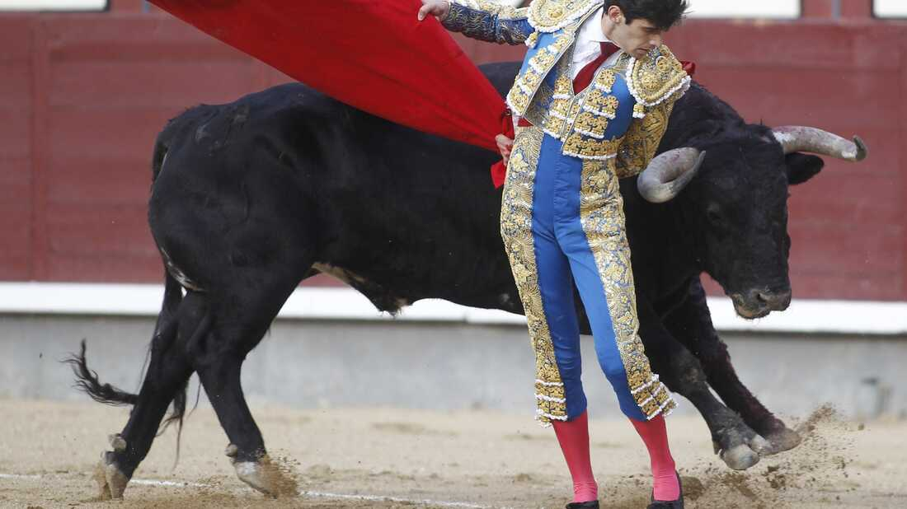
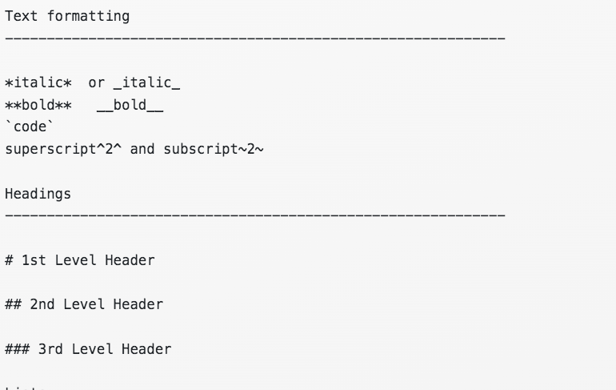
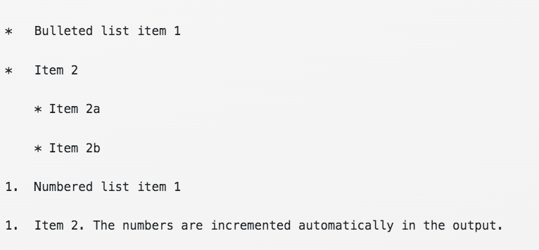
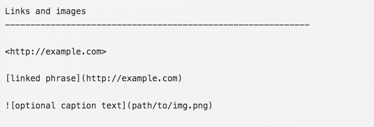

```{r child = "../setup.Rmd"}
```

```{r packages, echo = FALSE, message=FALSE, warning=FALSE}
library(tidyverse)
library(patchwork)
library(palmerpenguins)
```

class: middle

### 1. What is *p*-hacking and why should you avoid it?

### 2. Random tips and tricks

---

background-image: url(https://media.giphy.com/media/MCZ39lz83o5lC/giphy.gif)

---

class: middle, inverse

# ***p* value:** The probability of obtaining test results at least as extreme as the observed result due to random chance alone

---
class: center

### We often use *p* < 0.05 as the cutoff for an acceptable *p*-value, but this is somewhat arbitrary

<br/>

---

### Over-reliance on *p*-values can lead to questionable choices 

**Why might each of these be problematic?**

- Stop collecting data once *p* < 0.05

- Analyze many measures and/or conditions, but only report those with *p* < 0.05

- Exclude observations to get *p* < 0.05

- Transform the data to get *p* < 0.05

---

class: middle, inverse

## ***p*-hacking:** A misuse of data analysis to find patterns in data that can be presented as "statistically significant" when in fact there is no underlying effect.

---

### How to not *p*-hack: Instead of reporting only the good stuff, just report all the stuff

- Report your sample size

- List all variables and levels of categorical variables

- If excluding outliers, report results with outliers included as well

- Report results for all variables tested

---

***An apt metaphor for the phrase “statistically significant” and its relatives is that of a toro bravo, a champion bull raised for bullfighting who is now on his last legs and awaiting only the coup de grâce.***  [Hurlbert et al. 2019](https://www.tandfonline.com/doi/full/10.1080/00031305.2018.1543616)

```{r, echo = FALSE}

```

---

class: middle, inverse

.question[There is now wide agreement among many statisticians who have studied the issue that for reporting of statistical tests yielding p-values it is illogical and inappropriate to dichotomize the p-scale and describe results as “significant” and “nonsignificant.” Authors are strongly discouraged from continuing this never justified practice that originated from confusions in the early history of modern statistics.]

[Hurlbert et al. 2019](https://www.tandfonline.com/doi/full/10.1080/00031305.2018.1543616)

---

### How to not *p*-hack: Emphasize what your model results actually *mean* instead of *p-*values

- Report *p*-values but don't use the term, "statistically significant"

- Discuss apparent relationships or patterns

- **Interpret your results**, and explain their meaning in the context of your study system

--

**Assume both of these scenarios has *p* < 0.05. Which is more *ecologically* significant?**

"Growth rates were, on average, 5 times greater in the nutrient-treatment plots."

"Growth rates were, on average, 0.01 times greater in the  nutrient-treatment plots."


---

class: middle, inverse

# More R tips

---

class: middle

# Make sure you are comparing apples to apples! Normalize your data when appropriate.

---

### Where do the most motor vehicle deaths occur?

```{r, echo = FALSE, fig.height = 8}
mvd <- read_csv("data/motor-vehicle-deaths.csv")

ggplot(mvd, aes(x = Deaths, y = reorder(State, Deaths))) +
  geom_bar(stat = "identity") +
  labs(y = "", title = "Motor vehicle deaths") +
  theme_minimal()
```

---

### Where do the most motor vehicle deaths occur?

```{r, echo = FALSE, fig.height = 8}

p1 <- ggplot(mvd, aes(x = Deaths, y = reorder(State, Deaths))) +
  geom_bar(stat = "identity") +
  labs(y = "", title = "Motor vehicle deaths") +
  theme_minimal()

p2 <- ggplot(mvd, aes(x = Population, y = reorder(State, Population))) +
  geom_bar(stat = "identity") +
  labs(y = "", title = "Population") +
  theme_minimal()

p1 + p2
```

More people = more motor vehicle deaths. It's hard to tell whether it's because there are just more people living within each state or driving on the road, or because because there is a difference in traffic safety across states.

---

### Normalize your data if needed for your question

```{r, echo = FALSE}
ggplot(mvd, aes(x = `Deaths per 100,000 population`, y = reorder(State, `Deaths per 100,000 population`))) +
  geom_bar(stat = "identity") +
  labs(y = "", x = "Deaths per 100,000 population", 
       title = "Deaths per 100,000 population") +
  theme_minimal()
```

Normalized to population, Mississippi has the most motor vehicle deaths.

---

### Normalize your data if needed for your question

```{r, echo = FALSE}
ggplot(mvd, aes(x = `Deaths per 100 million vehicle miles traveled`, y = reorder(State, `Deaths per 100 million vehicle miles traveled`))) +
  geom_bar(stat = "identity") +
  labs(y = "", x = "Deaths per 100 million vehicle miles traveled", 
       title = "Deaths per 100 million vehicle miles traveled") +
  theme_minimal()
```

Normalized to vehicle miles traveled, South Carolina has the most motor vehicle deaths.

---

class: inverse, middle

### Use clean formatting in your R Markdown documents! 

---

## Use markdown syntax

```{r, echo = FALSE}

```

---

## Use markdown syntax

```{r, echo = FALSE}

```

---

## Use markdown syntax

```{r, echo = FALSE}

```

---

### Use `knitr::kable` to print tables

But only print tables if it's important for the reader to have that information. For example, printing a raw, unformatted data table is helpful to you as the data analyst, but not the reader. Remove this from your code before finalizing your report.

```{r}
penguins %>%
  filter(species == "Adelie")
```

---

class: inverse

### Cleanly formatting in your R Markdown documents: Use `knitr::kable` to print tables

However, printing a nice summary table can be quite useful.  

```{r}
knitr::kable(penguins %>%
  group_by(species, sex) %>%
  summarize(body_mass_g = round(mean(body_mass_g, na.rm = TRUE), 0)) %>%
    drop_na() %>%
    pivot_wider(names_from = sex, values_from = body_mass_g))
```

---

class: middle

# Use chunk options to control what appears in your knitted document

---

.pull-left-narrow[If you want to set the same chunk options for the entire document, use `knitr::opts_chunk$set()` in the first code chunk of your document]

.pull-right-wide[
```{r, echo = FALSE}
knitr::include_graphics("img/code-1-options.png")
```
]

---

.pull-left-narrow[Customize the output of individual chunks by defining chunk options in the {} of a chunk header]

.pull-right-wide[
```{r, echo = FALSE}
knitr::include_graphics("img/code-1-options.png")
```
]

---
# Commonly used chunk options

- `include = FALSE` prevents code and results from appearing in the finished file. R Markdown still runs the code in the chunk, and the results can be used by other chunks.
- `echo = FALSE` prevents code, but not the results from appearing in the finished file. This is a useful way to embed figures.
- `message = FALSE` prevents messages that are generated by code from appearing in the finished file.
- `warning = FALSE` prevents warnings that are generated by code from appearing in the finished.
- `fig.cap = "..."` adds a caption to graphical results.

See the [R Markdown Reference Guide](https://www.rstudio.com/wp-content/uploads/2015/03/rmarkdown-reference.pdf) for a complete list of knitr chunk options and a lot of additional information.

---

### Use the `patchwork` package to create plots with multiple panels when the y-axis variables are different

.panelset[
.panel[.panel-name[Plot]
```{r, echo = FALSE, warning = FALSE}
p1 <- ggplot(penguins, aes(x = bill_depth_mm, y = bill_length_mm, color = species)) +
  geom_point()

p2 <- ggplot(penguins, aes(x = flipper_length_mm, y = body_mass_g, color = species)) +
  geom_point()

p1 + p2
```
]

.panel[.panel-name[Code]
```{r, eval = FALSE}
p1 <- ggplot(penguins, aes(x = bill_depth_mm, y = bill_length_mm, color = species)) +
  geom_point() +
  labs(x = "Bill depth (mm)", y = "Bill length (mm)", color = "Species")

p2 <- ggplot(penguins, aes(x = flipper_length_mm, y = body_mass_g, color = species)) +
  geom_point() +
  labs(x = "Flipper length (mm)", y = "Body mass (g)", color = "Species")

p1 + p2 #<<
```
]
]
---

### Collect legend and move to the bottom; change the theme; add a figure title and panel labels

.panelset[
.panel[.panel-name[Plot]
```{r, echo = FALSE, warning = FALSE}
p1 <- ggplot(penguins, aes(x = bill_depth_mm, y = bill_length_mm, color = species)) +
  geom_point() +
  labs(x = "Bill depth (mm)", y = "Bill length (mm)", color = "Species")

p2 <- ggplot(penguins, aes(x = flipper_length_mm, y = body_mass_g, color = species)) +
  geom_point() +
  labs(x = "Flipper length (mm)", y = "Body mass (g)", color = "Species")

p1 + p2 + plot_layout(guides = "collect") + 
  plot_annotation(title = "Palmer penguin body metrics", tag_levels = "a") & 
  theme_light() & 
  theme(legend.position = "bottom")
```
]

.panel[.panel-name[Code]
```{r, eval = FALSE}
p1 <- ggplot(penguins, aes(x = bill_depth_mm, y = bill_length_mm, color = species)) +
  geom_point() +
  labs(x = "Bill depth (mm)", y = "Bill length (mm)", color = "Species")

p2 <- ggplot(penguins, aes(x = flipper_length_mm, y = body_mass_g, color = species)) +
  geom_point() +
  labs(x = "Flipper length (mm)", y = "Body mass (g)", color = "Species")

p1 + p2 + plot_layout(guides = "collect") + plot_annotation(title = "Palmer penguin body metrics", tag_levels = "a") & theme_light() & theme(legend.position = "bottom") #<<
```
]
]

---

### Use `facet_wrap()` to create plots with multiple panels when the y-axis variables are the same

.panelset[
.panel[.panel-name[Plot]
```{r, echo = FALSE, warning = FALSE}
ggplot(penguins, aes(x = bill_depth_mm, y = bill_length_mm, color = species)) +
  geom_point() +
  facet_wrap(~species) +
  labs(x = "Bill depth (mm)", y = "Bill length (mm)",
       title = "Palmer penguin bill metrics") +
  theme_light() +
  theme(legend.position = "none") 
```
]

.panel[.panel-name[Code]
```{r, eval = FALSE}
ggplot(penguins, aes(x = bill_depth_mm, y = bill_length_mm, color = species)) +
  geom_point() +
  facet_wrap(~species) + #<<
  labs(x = "Bill depth (mm)", y = "Bill length (mm)",
       title = "Palmer penguin bill metrics") +
  theme_light() +
  theme(legend.position = "none") 
```
]
]
---

class: middle

See the `patchwork` reference guide for many more plot layout and annotation options: https://patchwork.data-imaginist.com/index.html

---

# R Studio keyboard shortcuts

- **ALT + CTRL + I (PC) or OPTION + CMD + I (mac)** to insert a code chunk

- **ALT + left mouse click (PC) or OPTION + left click (mac)** to select and write on multiple lines - simultaneously. 

- **CTRL + SHIFT + M (PC) or CMD + SHIFT + M (mac)** to insert a %>% operator
- Place the cursor in the console and press **CTRL + UP (PC) or CMD + UP (mac)** to access navigate your console history 

- Place the cursor in the line of code you'd like to run (or highlight the code you want to run) and type **CTRL + Enter (PC) or CMD + Enter (mac)**
---

# Use these cheatsheets for quick reference!

.pull-left[
- [R basics](https://res.cloudinary.com/dyd911kmh/image/upload/v1654763044/Marketing/Blog/R_Cheat_Sheet.pdf)

- [R Markdown](https://github.com/rstudio/cheatsheets/blob/main/rmarkdown-2.0.pdf)

- [Data visualization with `ggplot2`](https://github.com/rstudio/cheatsheets/blob/main/data-visualization-2.1.pdf)

- [Data transformation with `dplyr`](https://github.com/rstudio/cheatsheets/blob/main/data-transformation.pdf)

- [Data tidying with `tidyr`](https://github.com/rstudio/cheatsheets/blob/main/tidyr.pdf)

- [Data import with `readr`, `readxl`, and `googlesheets4`](https://github.com/rstudio/cheatsheets/blob/main/data-import.pdf)

- [Dates and times with `lubridate`](https://github.com/rstudio/cheatsheets/blob/main/lubridate.pdf)
]

.pull-right[
- [Factors with `forcats`](https://github.com/rstudio/cheatsheets/blob/main/factors.pdf)

- [Apply functions with `purrr`](https://github.com/rstudio/cheatsheets/blob/main/purrr.pdf)
- [Create maps with `sf`](https://github.com/rstudio/cheatsheets/blob/main/mapsf.pdf)

- [...and many more](https://github.com/rstudio/cheatsheets)
]
