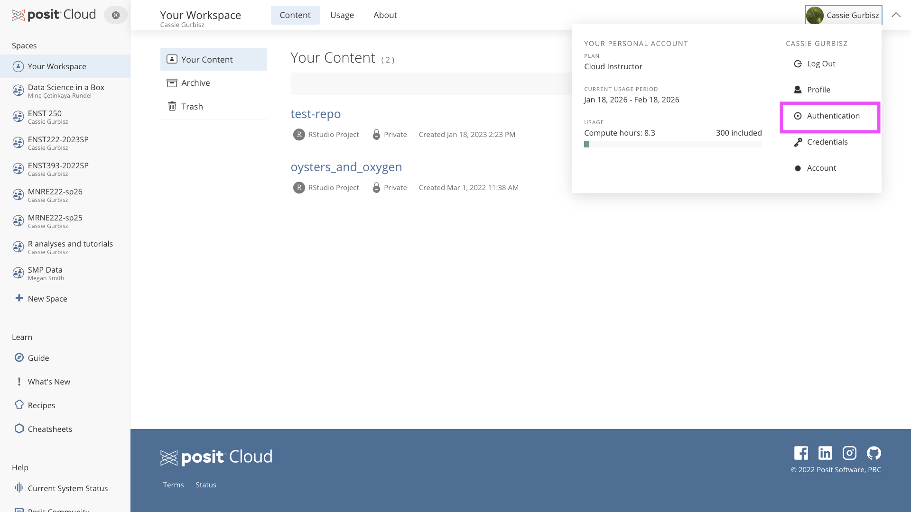
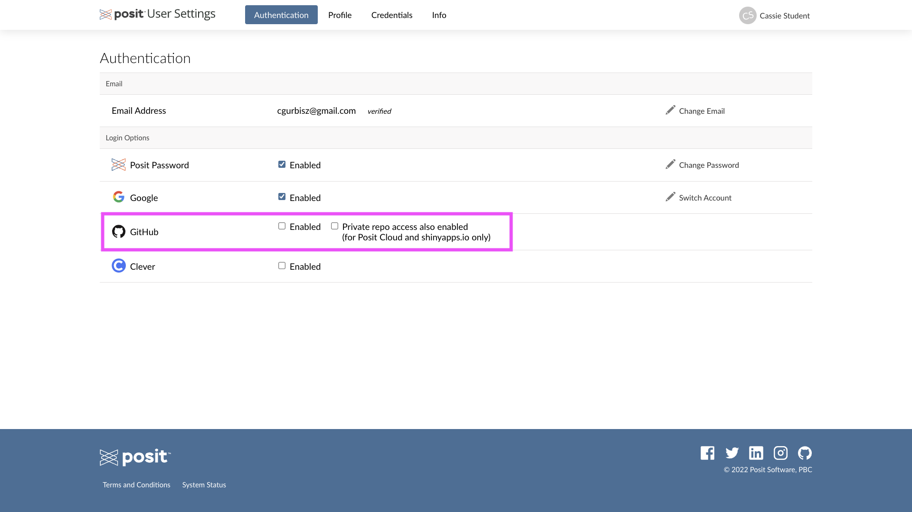
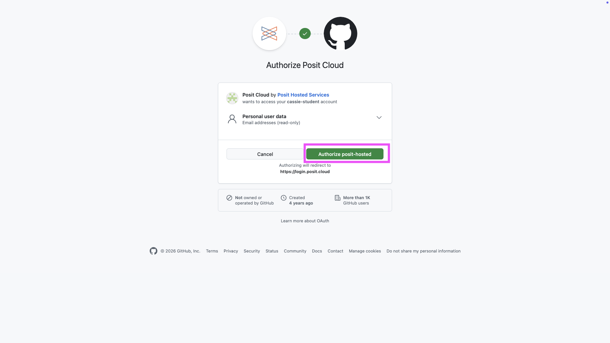
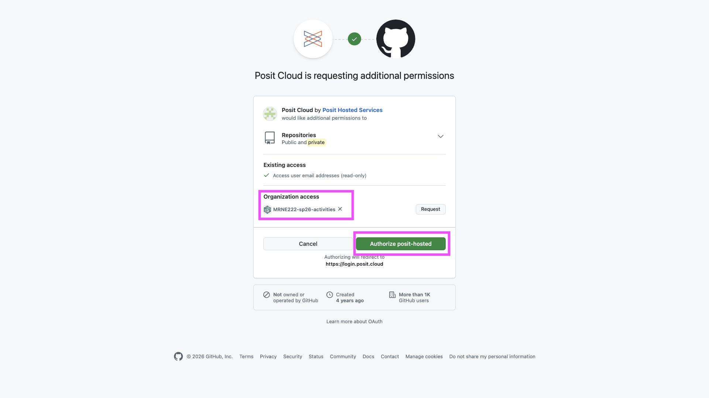
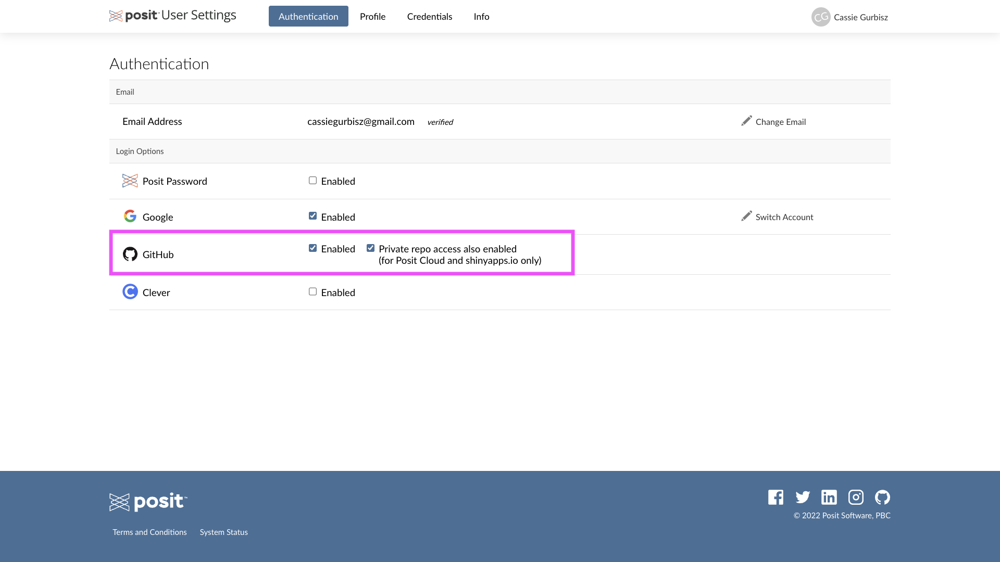
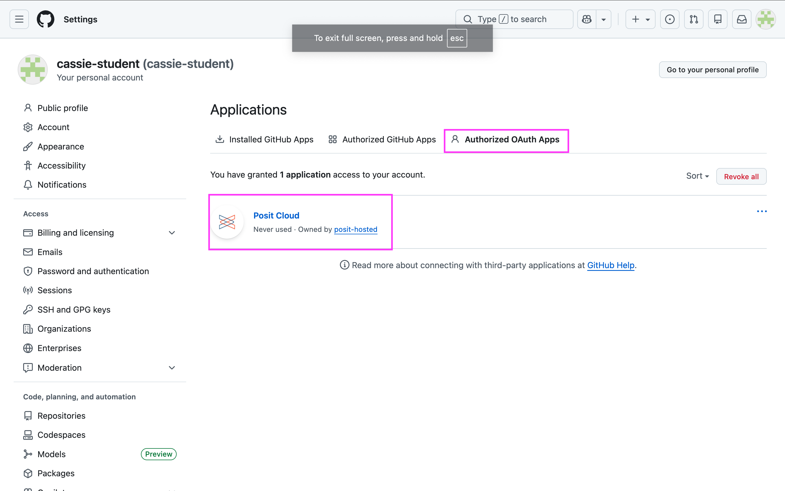
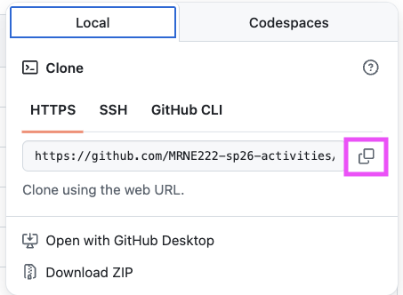
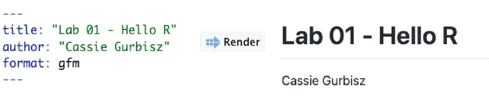
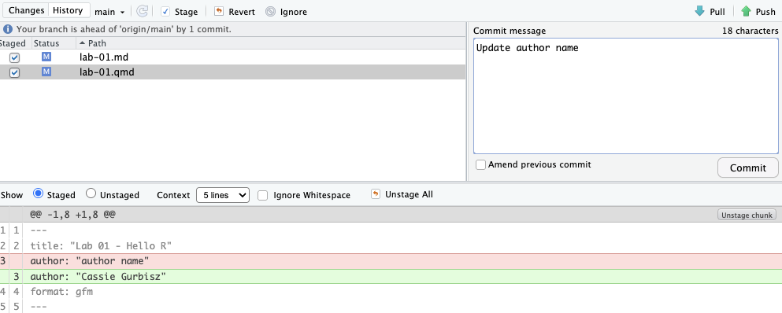

# Objectives

After completing this lab, you should be able to:

- clone a GitHub repository to your Posit Cloud workspace  
- edit and knit a Quarto file  
- commit edits locally using Git  
- push edits to GitHub  
- modify simple R code to explore and visualize data  

```{marginfigure}
R is the name of the programming language itself and RStudio is a convenient interface.
```

One goal of this lab is to introduce you to R, RStudio, and Quarto files, which we will be using throughout the course both to learn the statistical concepts discussed in the course and to analyze real data and come to informed conclusions. 

```{marginfigure}
git is a version control system (like "Track Changes" features from Microsoft Word on steroids) and GitHub is the home for your Git-based projects on the internet (like DropBox but much, much better).
```

An additional goal is to introduce you to Git and GitHub, which is the collaboration and version control system that we will be using throughout the course.

As the labs progress, you are encouraged to explore beyond what the labs dictate; a willingness to experiment will make you a much better programmer.
Before we get to that stage, however, you need to build some basic fluency in R.
Today we begin with the fundamental building blocks of R and RStudio: the interface, reading in data, and basic commands.

To make versioning simpler and to make sure everyone gets up and running with the tools, this is a solo lab (although I encourage you to talk to each other to make sure everyone is on the right track!).

In future labs you'll learn about collaborating on GitHub and produce a single lab report or project for your team.

# Connecting GitHub and Posit Cloud

I will be sending out an invitation to join the GitHub organization for this course. You need to accept the invitation before moving on to the next step.

Connect your RStudio and GitHub accounts by following the steps below:

-   In Posit Cloud, click on your name on the top right corner to open the right menu.
-   Then, click on Authentication.

```{r github-auth-1, echo = FALSE}

```

-   In the Authentication window, check the box next to the GitHub logo for *Enabled*.

```{r github-auth-2, echo = FALSE}

```

-   In the next window, click on the green box that says "Authorize posit hosted".

```{r github-auth-3, echo = FALSE}

```

-   Back in the Authentication window, check the box for *Private repo access also enabled*, and once again, on the green box that says "Authorize posit hosted" in the next window. At this point you should also make sure that the course organization shows up for you under *Organization access*. If it does not, this means you have not yet accepted the GitHub invitation to join the course, and you should go back and do that.

```{r github-auth-4, echo = FALSE}

```

-   Once you're done, both of these boxes should be checked.

```{r github-auth-5, echo = FALSE}

```

-   To confirm that you've successfully linked up your GitHub and Posit Cloud accounts, go to [GitHub settings \> Applications](https://github.com/settings/applications). You should see Posit Cloud listed as an authorized app under *Authorized OAuth Apps*. If you don't see this, now is a good time to ask for help (but first go back and re-read the instructions carefully to make sure you followed each step as specified).

```{r github-auth-6, echo = FALSE}

```

-   Next you need to set up a personal access token (PAT), which is sort of like a password that you can store on your computer to be able to easily access your GitHub account from RStudio. Go to github.com and make sure you're signed into your account.

-   In the upper-right corner of any page, click your profile photo, then click *Settings*.

-   In the left sidebar, click *Developer settings*, then select *Personal access tokens / Tokens (classic)*

-   Click Generate new token. Give your token a descriptive name.

-   To give your token an expiration, select the Expiration drop-down menu, then click a default or use the calendar picker. I suggest setting the expiration to a date after the semester ends.

-   Select the scopes you'd like to grant this token. We want to use the token to access repositories from the command line, so select *repo*.

-   Click Generate token. **You'll never be able to access the token again after you leave this page, so you should copy and paste it into a word doc or txt file saved to your desktop or course folder where you can easily find it.**

-   Now go back to Posit Cloud and open any project in our ENST/MRNE 222 workspace. Copy and paste the code below into your R console and replace the `---` with your PAT. Make sure to keep the quotes. Hit enter to run the code. You might be prompted to enter your PAT again. 
```{r}
credentials::set_github_pat("---")
```

-   You should now be all set up with GitHub! Keep your PAT file handy because you may need to enter it when you start a new Posit Cloud session or when you start a new RStudio project.

# Getting started

Each of your assignments will begin with the following steps. Note that each future lab will start with a "Getting started" section, but details will be a bit more sparse than this. You can always refer back to this lab for a detailed list of the steps involved for getting started with an assignment.

-   Click on the assignment link that you should have received in your email to create your GitHub repository (which we'll refer to as "repo" going forward) for the assignment. This repo contains a template you can build on to complete your assignment.

```{r clone-repo-link, fig.margin = TRUE, echo = FALSE, fig.width=3}

```

-   In GitHub, click on the green **<>Code** button, select **HTTPS** (this might already be selected by default). Click on the copy icon to copy the repo URL.

```{r new-project-from-gh, fig.margin = TRUE, echo = FALSE, fig.width=3}
knitr::include_graphics("img/new-project-from-gh.png")
```

-   Go to Posit Cloud and into the course workspace. Click on the **New Project** button and select from **New Project from Git Repo**.

```{r paste-gh-repo-url, fig.margin = TRUE, echo = FALSE, fig.width=5}
knitr::include_graphics("img/paste-gh-repo-url.png")
```

-   Copy and paste the URL of your assignment repo into the dialog box:

-   Hit OK, and you're good to go! You can use these instructions as a guide, but you should complete the remainder of the assignment in your cloned version of the lab in Posit Cloud.


## Warm up

Before we introduce the data, let's warm up with some simple exercises.

```{marginfigure}
The top portion of your Quarto file (between the three dashed lines) is called YAML. It stands for "yet another markup language" or "YAML ain't markup language". It is a human friendly data serialization standard for all programming languages. All you need to know is that this area is called the YAML (we will refer to it as such) and that it contains meta information about your document.
```

### YAML

Open the R Quarto (qmd) file in your project, change the author name to your name, and render the document by clicking on the "Render" button".

```{r yaml-raw-to-rendered, fig.fullwidth=TRUE, echo = FALSE}

```

### Committing changes

Then go to the Git pane in your RStudio, accessible as a tab in the top right RStudio pane. 

Click on the **Diff** button below the tabs in this pane.

If you have made changes to your qmd file, you should see those changes listed here.
This window shows you the *diff*erence between the last committed state of the document and its current state that includes your changes.
If you're happy with these changes, write "Update author name" in the **Commit message** box and hit **Commit**.

```{r update-author-name-commit, fig.fullwidth=TRUE, echo = FALSE}

```

You don't have to commit after every change. This would get quite cumbersome.
You should consider committing states, or *versions*, that are *meaningful to you* for inspection, comparison, or restoration.
In the first few assignments the instructions will tell you exactly when to commit and in some cases, what commit message to use.
As the semester progresses you will make these decisions.

### Pushing changes

Now that you have made an update and committed this change, it's time to push these changes to the web!
Or more specifically, to your repo on GitHub.
Why?
So that others can see your changes.
And by others, we mean the instructor (your repos in this course are private to you and the instructor, only).

In order to push your changes to GitHub, click the **Push** button.
This will prompt a dialogue box where you first need to enter your GitHub user name, and then your password.
This might feel cumbersome.
Bear with me... We *will* teach you how to save your password so you don't have to enter it every time.
But for this one assignment you'll have to manually enter each time you push in order to gain some experience with it.

## Packages

In this lab we will work with two packages: **datasauRus** which contains the dataset we'll be using and **tidyverse** which is a collection of packages for doing data analysis in a "tidy" way.
These packages are already installed for you.
You can load the packages by running the following in the Console.

```{r message=FALSE}
library(tidyverse) 
library(datasauRus)
```

Note that the packages are also loaded with the same commands in your R Markdown document.

## Data

```{marginfigure}
If it's confusing that the data frame is called `datasaurus_dozen` when it contains 13 datasets, you're not alone! Have you heard of a [baker's dozen](https://en.wikipedia.org/wiki/Dozen#Baker's_dozen)?
```

The data frame we will be working with today is called `datasaurus_dozen` and it's in the `datasauRus` package.
Actually, this single data frame contains 13 datasets, designed to show us why data visualization is important and how summary statistics alone can be misleading.
The different datasets are marked by the `dataset` variable.

To find out more about the dataset, type the following in your Console: `?datasaurus_dozen`.
A question mark before the name of an object will always bring up its help file.
This command must be ran in the Console.

# Exercises

1.  Based on the help file, how many rows and how many columns does the `datasaurus_dozen` file have? What variables included in the data frame? Add your responses to your lab report qmd document in Posit Cloud.

Let's take a look at what these datasets are.
To do so we can make a *frequency table* of the dataset variable:

```{r}
datasaurus_dozen %>%
  count(dataset)
```

```{marginfigure}
Matejka, Justin, and George Fitzmaurice. "Same stats, different graphs: Generating datasets with varied appearance and identical statistics through simulated annealing." Proceedings of the 2017 CHI Conference on Human Factors in Computing Systems. ACM, 2017.
```

The original Datasaurus (`dino`) was created by Alberto Cairo in [this great blog post](http://www.thefunctionalart.com/2016/08/download-datasaurus-never-trust-summary.html).
The other Dozen were generated using simulated annealing and the process is described in the paper *Same Stats, Different Graphs: Generating Datasets with Varied Appearance and Identical Statistics* through Simulated Annealing by Justin Matejka and George Fitzmaurice.
In the paper, the authors simulate a variety of datasets that have the same summary statistics as the Datasaurus but have very different distributions.
Render, commit

✅ ⬆️ *Render, commit and push your changes to GitHub with the commit message "Added answer for Ex 1". Make sure to commit and push all changed files so that your Git pane is cleared up afterwards.*

2.  Plot `y` vs. `x` for the `dino` dataset. Then, calculate the correlation coefficient between `x` and `y` for this dataset.

Below is the code you will need to complete this exercise.
Basically, the answer is already given, but you need to include relevant bits in your Rmd document and successfully knit it and view the results.

Start with the `datasaurus_dozen` and pipe it into the `filter` function to filter for observations where `dataset == "dino"`.
Store the resulting filtered data frame as a new data frame called `dino_data`.

```{r}
dino_data <- datasaurus_dozen %>%
  filter(dataset == "dino")
```

There is a lot going on here, so let's slow down and unpack it a bit.

First, the pipe operator: `%>%`, takes what comes before it and sends it as the first argument to what comes after it.
So here, we're saying `filter` the `datasaurus_dozen` data frame for observations where `dataset == "dino"`.

Note: You may also see `|>` in place of `%>%`. Both are pipe symbols and do basically the same thing.

Second, the assignment operator: `<-`, assigns the name `dino_data` to the filtered data frame.

Next, we need to visualize these data.
We will use the `ggplot` function for this.
Its first argument is the data you're visualizing.
Next we define the `aes`thetic mappings.
In other words, the columns of the data that get mapped to certain aesthetic features of the plot, e.g. the `x` axis will represent the variable called `x` and the `y` axis will represent the variable called `y`.
Then, we add another layer to this plot where we define which `geom`etric shapes we want to use to represent each observation in the data.
In this case we want these to be points, hence `geom_point`.

```{r fig.fullwidth=TRUE}
ggplot(data = dino_data, mapping = aes(x = x, y = y)) +
  geom_point()
```

For the second part of these exercises, we need to calculate a summary statistic: the correlation coefficient.
Correlation coefficient, often referred to as $r$ in statistics, measures the linear association between two variables.
You will see that some of the pairs of variables we plot do not have a linear relationship between them.
This is exactly why we want to visualize first: visualize to assess the form of the relationship, and calculate $r$ only if relevant.
In this case, calculating a correlation coefficient really doesn't make sense since the relationship between `x` and `y` is definitely not linear -- it's dinosaurial!

But, for illustrative purposes, let's calculate the correlation coefficient between `x` and `y`.

```{marginfigure}
Start with `dino_data` and calculate a summary statistic that we will call `r` as the `cor`relation between `x` and `y`.
```

```{r}
dino_data %>%
  summarize(r = cor(x, y))
```

✅ ⬆️ *Render, commit and push your changes to GitHub with the commit message "Added answer for Ex 2". Make sure to commit and push all changed files so that your Git pane is cleared up afterwards.*

3.  Plot `y` vs. `x` for the `star` dataset. You can (and should) reuse code we introduced above, just replace the dataset name with the desired dataset. Then, calculate the correlation coefficient between `x` and `y` for this dataset. How does this value compare to the `r` of `dino`?

✅ ⬆️ *This is another good place to pause, render, commit changes with the commit message "Added answer for Ex 3", and push. Make sure to commit and push all changed files so that your Git pane is cleared up afterwards.*

4.  Plot `y` vs. `x` for the `circle` dataset. You can (and should) reuse code we introduced above, just replace the dataset name with the desired dataset. Then, calculate the correlation coefficient between `x` and `y` for this dataset. How does this value compare to the `r` of `dino`?

✅ ⬆️ *You should pause again, render, commit changes with the commit message "Added answer for Ex 4", and push. Make sure to commit and push all changed files so that your Git pane is cleared up afterwards.*

```{marginfigure}
Facet by the dataset variable, placing the plots in a 3 column grid, and don't add a legend.
```

5.  Finally, let's plot all datasets at once. In order to do this we will make use of faceting.

```{r all-viz, eval=FALSE, fig.fullwidth=TRUE}
ggplot(datasaurus_dozen, aes(x = x, y = y, color = dataset))+
  geom_point()+
  facet_wrap(~ dataset, ncol = 3) +
  theme(legend.position = "none")
```

And we can use the `group_by` function to generate all the summary correlation coefficients.

```{r all-r, eval=FALSE}
datasaurus_dozen %>%
  group_by(dataset) %>%
  summarize(r = cor(x, y))
```

You're done with the data analysis exercises, but I'd like you to do one more thing:

```{r fig-resize-global, fig.margin = TRUE, echo = FALSE, fig.width=3}
knitr::include_graphics("img/fig-resize-global.png")
```


-   **Try different text formatting options:**

Open the Markdown Quick Reference, accessible via the Help menu. Use the Quick Reference to find markdown syntax to do the following anywhere in the last paragraph of random text in the starter qmd document:

- bold text
- italicized text
- headers
- unordered list
- ordered list
- link to a website

Knit periodically to make sure you understand how your markdown code translates in the knitted document.

6. Answer the following questions to check your learning:

- In your own words, briefly explain what Git and GitHub do and how they work.
- In your own words, what does the pipe operator (`%>%`) do?
- In your own words, what does the assignment operator (`<-`) do?
- Why is it important to visualize data?
- Among the topics this lab has covered, what is still the fuzziest concept for you? 

<br>


✅ ⬆️ *You're done! Render one more time, commit all remaining changes, use the commit message "Done with lab 1!", and push. Make sure to commit and push all changed files so that your Git pane is clear. Then make sure all of the documents are updated in your GitHub repo.*
